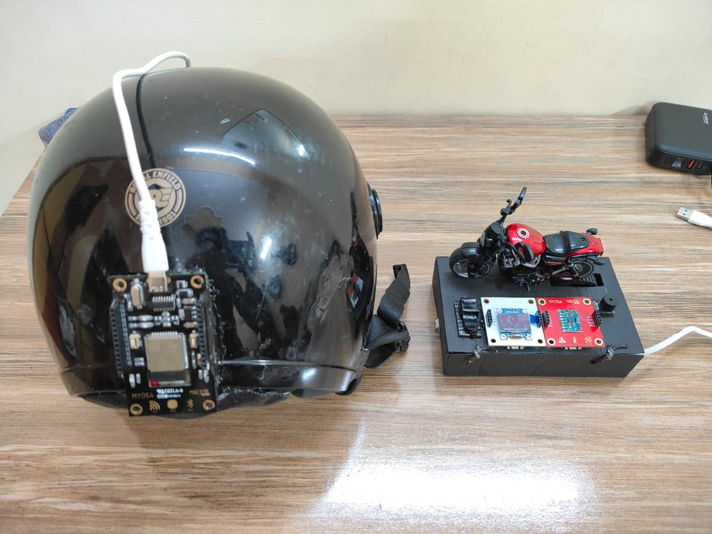
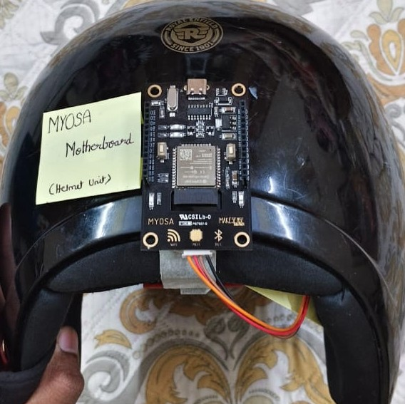
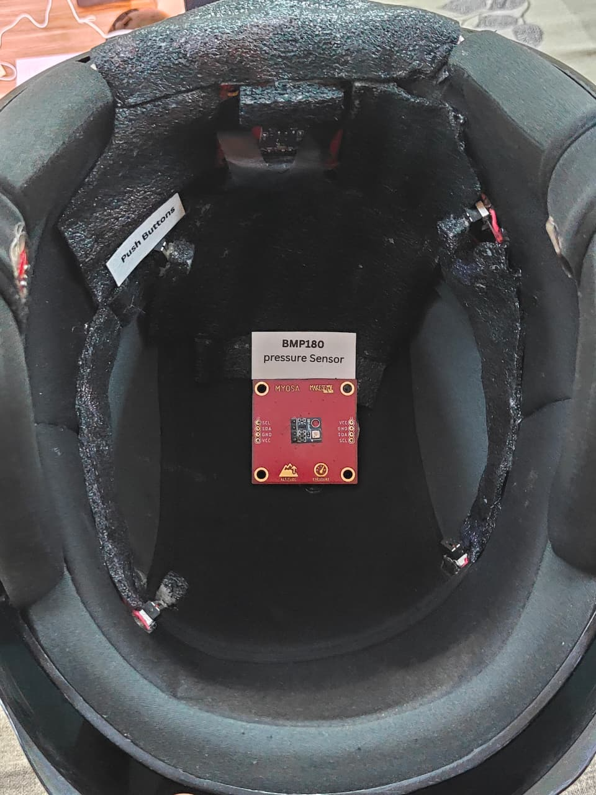
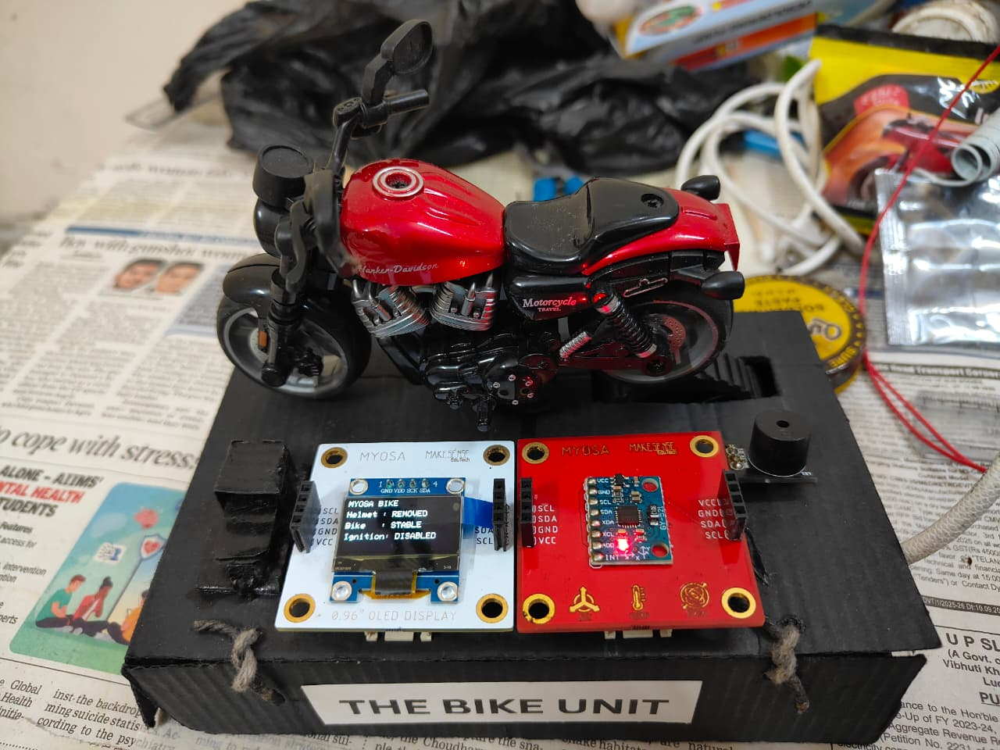
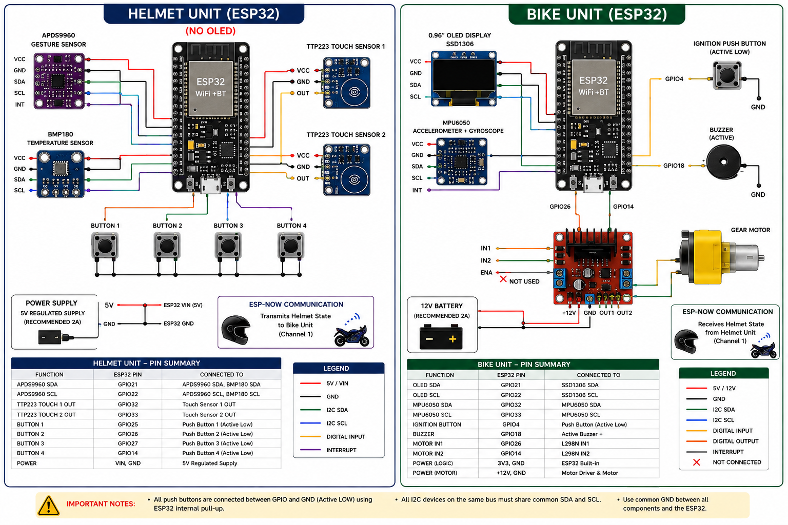

> Guardian Link: Secure, Wearable Sensor Interlock for Two-Wheeler Safety

---


## Acknowledgements
This project was developed as a smart two-wheeler safety and rider-assistance system.

## Overview

The Secure Ride System is a smart helmet–bike interlock safety system designed for two-wheelers. The system ensures that vehicle ignition can be enabled only when the required helmet-wear conditions are satisfied.

The system follows a dual-microcontroller architecture, consisting of a dedicated helmet unit and a bike unit. The helmet unit uses an ESP32 with an APDS9960 gesture sensor, BMP180 temperature sensor, two TTP223 capacitive touch sensors, and four push-button inputs to verify that the helmet is properly worn. Once all required conditions are satisfied, the helmet unit wirelessly transmits the helmet status to the bike unit using ESP-NOW.

The bike unit uses a separate ESP32 connected to an SSD1306 OLED display, MPU6050 accelerometer/gyroscope, ignition push button, buzzer, and motor driver. The received helmet status controls the ignition interlock, while the MPU6050 provides fall and crash detection based on motion and tilt conditions.

Overall, the system combines helmet-wear verification, wireless ignition control, motion-based fall/crash detection, visual status monitoring, and audible alerts into a distributed two-wheeler safety system.

## Demo / Examples

### Images

 
<p align="center">
  <br/>
  <i>Overall architecture of the MYOSA Secure Ride System</i>
</p>


<p align="center">
  <br/>
  <br/>
  <i>Helmet unit using MYOSA Motherboard</i>  
</p>

<p align="center">
  <br/>
  <i>Vehicle Unit using External ESP32</i>
</p>
<p align="center">
  <br/>
  <i>Circuit Diagram Representation of The Guardian Link</i>
</p>


### Videos

<video controls width="100%">
  <source src="/Videos/demonstration.mp4" type="video/mp4"> 
</video>
<i>Demonstration of The Guardian Link</i> 

If video not playing above. 👉 [View Demonstration Video](./myosa-demonstration.mp4) 

<video controls width="100%">
  <source src="/Videos/presentation.mp4" type="video/mp4">
</video>
<i>Presentation on The Guardian Link</i> 

If video not playing above. 👉 [View Presentation Video](./myosa-presentation.mp4) 

## Code
### Helmet Unit

```
/*
  ================================================================
                 GUARDIAN LINK – HELMET UNIT V7
      ADAPTIVE THERMAL + SMART TOUCH LATCH + SENSOR FUSION
                    + 3-STATE HELMET STATUS
                    + RESEARCH LOGGER
  ================================================================

  HELMET STATES
  ----------------------
      0 = REMOVED
      1 = LOOSE
      2 = PROPER

  AUTHENTICATION FACTORS
  ----------------------
      1. Gesture
      2. Adaptive Temperature
      3. Touch / Touch-Latch
      4. Push Buttons

  PROPER
  ----------------------
      Gesture = YES
      Temperature = YES
      Touch Latch = YES
      Buttons >= 2

  LOOSE
  ----------------------
      Gesture = YES
      Temperature = YES
      Raw Touch = YES
      Buttons < 2

      NOTE:
      Touch Latch cannot be YES when buttons < 2 because
      the latch logic intentionally resets it.

  REMOVED
  ----------------------
      Any condition not satisfying PROPER or LOOSE.

  SERIAL COMMANDS
  ----------------
      T = Start Trial
      E = End Trial
      R = Reset Adaptive Baseline

  ================================================================
*/

#include <Wire.h>
#include <WiFi.h>
#include <esp_now.h>
#include <esp_wifi.h>

#include <Adafruit_GFX.h>
#include <Adafruit_SSD1306.h>
#include <Adafruit_BMP085.h>

#include "LightProximityAndGesture.h"


/* ================================================================
   OLED
   ================================================================ */

#define SCREEN_WIDTH 128
#define SCREEN_HEIGHT 64

Adafruit_SSD1306 display(
  SCREEN_WIDTH,
  SCREEN_HEIGHT,
  &Wire,
  -1
);


/* ================================================================
   SENSOR OBJECTS
   ================================================================ */

LightProximityAndGesture Lpg;
Adafruit_BMP085 bmp;

bool bmpOK = false;


/* ================================================================
   TOUCH
   ================================================================ */

#define TOUCH1_PIN 32
#define TOUCH2_PIN 33


/* ================================================================
   BUTTONS
   ================================================================ */

#define BTN1_PIN 25
#define BTN2_PIN 26
#define BTN3_PIN 27
#define BTN4_PIN 14


/* ================================================================
   GESTURE
   ================================================================ */

bool gestureDetected = false;
bool gestureOK = false;

unsigned long gestureStateStart = 0;

const unsigned long GESTURE_CONFIRM_MS = 5000;


/* ================================================================
   ADAPTIVE TEMPERATURE
   ================================================================ */

float currentTemp = 0.0;
float smoothedTemp = 0.0;

float adaptiveBaseline = 0.0;
float frozenBaseline = 0.0;

float deltaT = 0.0;
float tempRate = 0.0;


/* ================================================================
   TEMPERATURE SAMPLING
   ================================================================ */

const unsigned long TEMP_SAMPLE_INTERVAL_MS = 500;

unsigned long lastTempSample = 0;


/* ================================================================
   TEMPERATURE FILTER
   ================================================================ */

const float TEMP_FILTER_ALPHA = 0.20;


/* ================================================================
   TEMPERATURE RATE
   ================================================================ */

const unsigned long RATE_WINDOW_MS = 10000;

float rateStartTemp = 0.0;
unsigned long rateStartTime = 0;


/* ================================================================
   ADAPTIVE BASELINE
   ================================================================ */

const float BASELINE_ALPHA = 0.01;


/* ================================================================
   THERMAL THRESHOLDS
   ================================================================ */

const float TEMP_THRESHOLD = 0.50;
const float TEMP_RATE_THRESHOLD = 0.005;

bool thermalRiseConfirmed = false;
bool thermalSampleReady = false;
bool baselineFrozen = false;


/* ================================================================
   TOUCH LATCH SYSTEM
   ================================================================ */

bool touchLatch = false;

bool touchConfirmTimerActive = false;

unsigned long touchConfirmStart = 0;

const unsigned long TOUCH_LATCH_CONFIRM_MS = 5000;


/* ================================================================
   TOUCH STATE ENUMERATION
   ================================================================ */

enum TouchLatchState {
  TOUCH_IDLE,
  TOUCH_CONFIRMING,
  TOUCH_LATCHED
};

TouchLatchState touchState =
  TOUCH_IDLE;


/* ================================================================
   HELMET STATE
   ================================================================ */

enum HelmetState {

  HELMET_REMOVED = 0,

  HELMET_LOOSE = 1,

  HELMET_PROPER = 2
};

HelmetState helmetState =
  HELMET_REMOVED;

HelmetState lastSentState =
  HELMET_REMOVED;


/* ================================================================
   ESP-NOW
   ================================================================ */

uint8_t bikeMAC[] = {

  0xA4,
  0xF0,
  0x0F,
  0x5C,
  0x36,
  0xF0
};

esp_now_peer_info_t peerInfo;


/* ================================================================
   ESP-NOW FLAGS
   ================================================================ */

bool espNowSent = false;
bool espNowSuccess = false;


/* ================================================================
   TRIAL LOGGER
   ================================================================ */

bool trialActive = false;

unsigned int trialNumber = 0;

unsigned long trialStartTime = 0;


/* ================================================================
   AUTHENTICATION TIMER
   ================================================================ */

bool authenticationTimerStarted = false;

unsigned long authenticationStartTime = 0;

unsigned long authenticationTime = 0;

bool authenticationCompleted = false;


/* ================================================================
   RESEARCH LOGGER
   ================================================================ */

unsigned long lastResearchLog = 0;

const unsigned long RESEARCH_LOG_INTERVAL = 250;


/* ================================================================
   BUTTON COUNT
   ================================================================ */

int getButtonCount() {

  int count = 0;

  if (digitalRead(BTN1_PIN) == LOW)
    count++;

  if (digitalRead(BTN2_PIN) == LOW)
    count++;

  if (digitalRead(BTN3_PIN) == LOW)
    count++;

  if (digitalRead(BTN4_PIN) == LOW)
    count++;

  return count;
}


/* ================================================================
   BUTTON VALIDATION
   ================================================================ */

bool buttonsPressed() {

  return getButtonCount() >= 2;
}


/* ================================================================
   INDIVIDUAL BUTTONS
   ================================================================ */

bool button1Pressed() {
  return digitalRead(BTN1_PIN) == LOW;
}

bool button2Pressed() {
  return digitalRead(BTN2_PIN) == LOW;
}

bool button3Pressed() {
  return digitalRead(BTN3_PIN) == LOW;
}

bool button4Pressed() {
  return digitalRead(BTN4_PIN) == LOW;
}


/* ================================================================
   RAW TOUCH
   ================================================================ */

bool touch1Active() {

  return digitalRead(TOUCH1_PIN) == HIGH;
}


bool touch2Active() {

  return digitalRead(TOUCH2_PIN) == HIGH;
}


bool rawTouchActive() {

  return (
    touch1Active() ||
    touch2Active()
  );
}


/* ================================================================
   HELMET STATE TEXT
   ================================================================ */

const char* helmetStateText() {

  switch (helmetState) {

    case HELMET_REMOVED:
      return "REMOVED";

    case HELMET_LOOSE:
      return "LOOSE";

    case HELMET_PROPER:
      return "PROPER";
  }

  return "UNKNOWN";
}


/* ================================================================
   TOUCH LATCH UPDATE
   ================================================================ */

bool updateTouchLatch() {

  unsigned long now = millis();

  bool rawTouch =
    rawTouchActive();

  int buttonCount =
    getButtonCount();

  bool enoughButtons =
    buttonCount >= 2;


  /* ============================================================
     CONDITION 1:
     BUTTONS LESS THAN 2 ALWAYS RESET THE LATCH
     ============================================================ */

  if (!enoughButtons) {

    if (touchLatch) {

      Serial.println(
        "TOUCH_LATCH_RESET_BUTTONS_LT_2"
      );
    }

    touchLatch = false;

    touchState =
      TOUCH_IDLE;

    touchConfirmTimerActive =
      false;

    touchConfirmStart =
      0;

    return false;
  }


  /* ============================================================
     CONDITION 2:
     LATCH ALREADY ACTIVE
     ============================================================ */

  if (touchLatch) {

    touchState =
      TOUCH_LATCHED;

    return true;
  }


  /* ============================================================
     CONDITION 3:
     NOT LATCHED YET
     ============================================================ */

  if (rawTouch) {

    if (!touchConfirmTimerActive) {

      touchConfirmTimerActive =
        true;

      touchConfirmStart =
        now;

      touchState =
        TOUCH_CONFIRMING;

      Serial.println(
        "TOUCH_CONFIRMATION_STARTED"
      );
    }


    if (
      now -
      touchConfirmStart
      >=
      TOUCH_LATCH_CONFIRM_MS
    ) {

      touchLatch =
        true;

      touchState =
        TOUCH_LATCHED;

      touchConfirmTimerActive =
        false;

      Serial.println(
        "TOUCH_LATCH_PERMANENTLY_ENABLED"
      );
    }
  }

  else {

    if (touchConfirmTimerActive) {

      Serial.println(
        "TOUCH_CONFIRMATION_CANCELLED"
      );
    }

    touchConfirmTimerActive =
      false;

    touchConfirmStart =
      0;

    touchState =
      TOUCH_IDLE;
  }


  return touchLatch;
}


/* ================================================================
   INITIALIZE ADAPTIVE BASELINE
   ================================================================ */

void initializeAdaptiveBaseline() {

  if (!bmpOK)
    return;

  float sum = 0.0;

  Serial.println();
  Serial.println(
    "INITIALIZING ADAPTIVE BASELINE..."
  );

  for (int i = 0; i < 30; i++) {

    sum += bmp.readTemperature();

    delay(50);
  }

  adaptiveBaseline =
    sum / 30.0;

  currentTemp =
    adaptiveBaseline;

  smoothedTemp =
    adaptiveBaseline;

  rateStartTemp =
    smoothedTemp;

  rateStartTime =
    millis();

  lastTempSample =
    millis();

  baselineFrozen =
    false;

  thermalRiseConfirmed =
    false;

  thermalSampleReady =
    true;

  Serial.print(
    "Adaptive_Baseline_C="
  );

  Serial.println(
    adaptiveBaseline,
    3
  );

  Serial.println(
    "BASELINE_READY"
  );
}


/* ================================================================
   UPDATE TEMPERATURE
   ================================================================ */

void updateTemperature() {

  if (!bmpOK)
    return;

  unsigned long now =
    millis();

  if (
    now -
    lastTempSample
    <
    TEMP_SAMPLE_INTERVAL_MS
  ) {

    return;
  }

  lastTempSample =
    now;


  /* RAW TEMPERATURE */

  currentTemp =
    bmp.readTemperature();


  /* SMOOTH TEMPERATURE */

  if (!thermalSampleReady) {

    smoothedTemp =
      currentTemp;

    rateStartTemp =
      currentTemp;

    rateStartTime =
      now;

    thermalSampleReady =
      true;
  }

  else {

    smoothedTemp =
      (
        TEMP_FILTER_ALPHA *
        currentTemp
      )
      +
      (
        (1.0 -
         TEMP_FILTER_ALPHA) *
        smoothedTemp
      );
  }


  /* LONG-WINDOW TEMPERATURE RATE */

  if (
    now -
    rateStartTime
    >=
    RATE_WINDOW_MS
  ) {

    float elapsed =
      (
        now -
        rateStartTime
      )
      /
      1000.0;

    if (elapsed > 0) {

      tempRate =
        (
          smoothedTemp -
          rateStartTemp
        )
        /
        elapsed;
    }

    rateStartTemp =
      smoothedTemp;

    rateStartTime =
      now;
  }


  /* ============================================================
     PHYSICAL WEAR DETECTION
     
     IMPORTANT CHANGE:
     
     Raw touch is now considered physical contact for the
     temperature baseline even when fewer than 2 buttons
     are pressed.

     This is necessary to allow the LOOSE state to be
     experimentally identified.
     ============================================================ */

  bool physicalWear =
    rawTouchActive() ||
    touchLatch ||
    buttonsPressed();


  /* ============================================================
     NO PHYSICAL WEAR
     ============================================================ */

  if (!physicalWear) {

    adaptiveBaseline =
      (
        BASELINE_ALPHA *
        smoothedTemp
      )
      +
      (
        (1.0 -
         BASELINE_ALPHA) *
        adaptiveBaseline
      );

    baselineFrozen =
      false;

    thermalRiseConfirmed =
      false;

    deltaT =
      smoothedTemp -
      adaptiveBaseline;

    return;
  }


  /* ============================================================
     PHYSICAL WEAR DETECTED
     ============================================================ */

  if (!baselineFrozen) {

    frozenBaseline =
      adaptiveBaseline;

    baselineFrozen =
      true;

    thermalRiseConfirmed =
      false;


    /* Restart thermal-rate window */

    rateStartTemp =
      smoothedTemp;

    rateStartTime =
      now;

    Serial.println();

    Serial.println(
      "THERMAL_BASELINE_FROZEN"
    );

    Serial.print(
      "Frozen_Baseline_C="
    );

    Serial.println(
      frozenBaseline,
      3
    );
  }


  /* ΔT */

  deltaT =
    smoothedTemp -
    frozenBaseline;


  /* THERMAL RISE CONFIRMATION */

  bool deltaValid =
    deltaT >=
    TEMP_THRESHOLD;

  bool rateValid =
    tempRate >=
    TEMP_RATE_THRESHOLD;


  if (
    !thermalRiseConfirmed &&
    deltaValid &&
    rateValid
  ) {

    thermalRiseConfirmed =
      true;

    Serial.println();

    Serial.println(
      "THERMAL_RISE_CONFIRMED"
    );

    Serial.print(
      "DeltaT_C="
    );

    Serial.println(
      deltaT,
      3
    );

    Serial.print(
      "TempRate_Cps="
    );

    Serial.println(
      tempRate,
      4
    );
  }
}


/* ================================================================
   GESTURE
   ================================================================ */

void updateGesture() {

  unsigned long now =
    millis();

  bool newGesture =
    gestureDetected;


  if (Lpg.ping()) {

    char* g =
      Lpg.getGesture();

    if (
      g != nullptr &&
      g[0] != '\0'
    ) {

      newGesture =
        (
          String(g) ==
          "TIMEOUT"
        );
    }

    else {

      newGesture =
        true;
    }
  }


  if (
    newGesture !=
    gestureDetected
  ) {

    gestureDetected =
      newGesture;

    gestureStateStart =
      now;
  }


  gestureOK =
    gestureDetected &&
    (
      now -
      gestureStateStart
      >=
      GESTURE_CONFIRM_MS
    );
}


/* ================================================================
   TEMPERATURE VALIDATION
   ================================================================ */

bool temperatureOK() {

  if (!baselineFrozen)
    return false;

  if (!thermalRiseConfirmed)
    return false;

  return (
    deltaT >=
    TEMP_THRESHOLD
  );
}


/* ================================================================
   AUTHENTICATION TIMER
   ================================================================ */

void updateAuthenticationTimer(
  bool touchOK,
  bool buttonOK
) {

  unsigned long now =
    millis();


  if (
    touchOK &&
    buttonOK &&
    !authenticationTimerStarted
  ) {

    authenticationTimerStarted =
      true;

    authenticationCompleted =
      false;

    authenticationStartTime =
      now;

    Serial.println(
      "AUTH_TIMER_STARTED"
    );
  }
}


/* ================================================================
   HELMET STATE FUSION
   ================================================================ */

void updateHelmetState() {

  bool rawTouch = rawTouchActive();
  bool buttonOK = buttonsPressed();
  bool tempOK = temperatureOK();

  /*
    ============================================================
    PROPER
    ============================================================

    All authentication factors satisfied:

    Gesture = YES
    Temperature = YES
    Touch Latch = YES
    Buttons >= 2
    ============================================================
  */

  if (
    gestureOK &&
    tempOK &&
    touchLatch &&
    buttonOK
  ) {

    helmetState = HELMET_PROPER;
    return;
  }


  /*
    ============================================================
    LOOSE / AUTHENTICATION IN PROGRESS
    ============================================================

    The helmet is physically detected/worn and the main
    physical/authentication indicators are valid, but
    authentication is not yet complete.

    This includes:

    1. ButtonCount < 2
       -> waiting for the required button presses

    2. ButtonCount >= 2 but Touch Latch is still confirming
       -> authentication is still in progress

    Keeping this state active prevents the unwanted:

        LOOSE -> REMOVED -> PROPER

    transition.

    Instead the intended transition is:

        LOOSE -> PROPER
    ============================================================
  */

  if (
    gestureOK &&
    tempOK &&
    rawTouch
  ) {

    helmetState = HELMET_LOOSE;
    return;
  }


  /*
    ============================================================
    REMOVED
    ============================================================

    Physical wear/authentication indicators are no longer
    sufficient to identify the helmet as being worn.
    ============================================================
  */

  helmetState = HELMET_REMOVED;
}

/* ================================================================
   START TRIAL
   ================================================================ */

void startTrial() {

  if (trialActive) {

    Serial.println(
      "ERROR: TRIAL_ALREADY_ACTIVE"
    );

    return;
  }


  trialNumber++;

  trialActive =
    true;

  trialStartTime =
    millis();


  authenticationTimerStarted =
    false;

  authenticationCompleted =
    false;

  authenticationTime =
    0;


  espNowSent =
    false;

  espNowSuccess =
    false;


  lastResearchLog =
    millis();


  Serial.println();

  Serial.println(
    "================================================"
  );

  Serial.print(
    "TRIAL_START,"
  );

  Serial.println(
    trialNumber
  );


  Serial.print(
    "Baseline_at_Start_C="
  );

  Serial.println(
    adaptiveBaseline,
    3
  );


  Serial.println(
    "CSV_HEADER,"
    "Trial,"
    "Elapsed_ms,"
    "RawTemp_C,"
    "SmoothedTemp_C,"
    "AdaptiveBaseline_C,"
    "FrozenBaseline_C,"
    "DeltaT_C,"
    "TempRate_Cps,"
    "ThermalRiseConfirmed,"
    "Gesture,"
    "TouchRaw,"
    "TouchLatch,"
    "Touch1,"
    "Touch2,"
    "Button1,"
    "Button2,"
    "Button3,"
    "Button4,"
    "ButtonCount,"
    "ButtonsOK,"
    "TemperatureOK,"
    "HelmetState"
  );

  Serial.println(
    "================================================"
  );
}


/* ================================================================
   RESEARCH LOGGER
   ================================================================ */

void logResearchData() {

  if (!trialActive)
    return;


  unsigned long now =
    millis();


  if (
    now -
    lastResearchLog
    <
    RESEARCH_LOG_INTERVAL
  ) {

    return;
  }


  lastResearchLog =
    now;


  bool rawTouch =
    rawTouchActive();

  bool t1 =
    touch1Active();

  bool t2 =
    touch2Active();

  bool b1 =
    button1Pressed();

  bool b2 =
    button2Pressed();

  bool b3 =
    button3Pressed();

  bool b4 =
    button4Pressed();

  bool buttonsOK =
    buttonsPressed();

  bool tempOK =
    temperatureOK();


  Serial.print(
    "DATA,"
  );

  Serial.print(
    trialNumber
  );

  Serial.print(",");

  Serial.print(
    now -
    trialStartTime
  );

  Serial.print(",");

  Serial.print(
    currentTemp,
    3
  );

  Serial.print(",");

  Serial.print(
    smoothedTemp,
    3
  );

  Serial.print(",");

  Serial.print(
    adaptiveBaseline,
    3
  );

  Serial.print(",");

  Serial.print(
    frozenBaseline,
    3
  );

  Serial.print(",");

  Serial.print(
    deltaT,
    3
  );

  Serial.print(",");

  Serial.print(
    tempRate,
    4
  );

  Serial.print(",");

  Serial.print(
    thermalRiseConfirmed
    ? 1
    : 0
  );

  Serial.print(",");

  Serial.print(
    gestureOK
    ? 1
    : 0
  );

  Serial.print(",");

  Serial.print(
    rawTouch
    ? 1
    : 0
  );

  Serial.print(",");

  Serial.print(
    touchLatch
    ? 1
    : 0
  );

  Serial.print(",");

  Serial.print(
    t1
    ? 1
    : 0
  );

  Serial.print(",");

  Serial.print(
    t2
    ? 1
    : 0
  );

  Serial.print(",");

  Serial.print(
    b1
    ? 1
    : 0
  );

  Serial.print(",");

  Serial.print(
    b2
    ? 1
    : 0
  );

  Serial.print(",");

  Serial.print(
    b3
    ? 1
    : 0
  );

  Serial.print(",");

  Serial.print(
    b4
    ? 1
    : 0
  );

  Serial.print(",");

  Serial.print(
    getButtonCount()
  );

  Serial.print(",");

  Serial.print(
    buttonsOK
    ? 1
    : 0
  );

  Serial.print(",");

  Serial.print(
    tempOK
    ? 1
    : 0
  );

  Serial.print(",");

  Serial.println(
    helmetState
  );
}


/* ================================================================
   END TRIAL
   ================================================================ */

void endTrial() {

  if (!trialActive) {

    Serial.println(
      "ERROR: NO_ACTIVE_TRIAL"
    );

    return;
  }


  unsigned long now =
    millis();

  unsigned long trialDuration =
    now -
    trialStartTime;


  Serial.println();

  Serial.println(
    "TRIAL_SUMMARY"
  );


  Serial.print(
    "Trial="
  );

  Serial.println(
    trialNumber
  );


  Serial.print(
    "Duration_ms="
  );

  Serial.println(
    trialDuration
  );


  Serial.print(
    "Authentication_Time_ms="
  );


  if (authenticationCompleted) {

    Serial.println(
      authenticationTime
    );
  }

  else {

    Serial.println(
      "NOT_COMPLETED"
    );
  }


  Serial.print(
    "Adaptive_Baseline_C="
  );

  Serial.println(
    adaptiveBaseline,
    3
  );


  Serial.print(
    "Frozen_Baseline_C="
  );

  Serial.println(
    frozenBaseline,
    3
  );


  Serial.print(
    "Final_Raw_Temp_C="
  );

  Serial.println(
    currentTemp,
    3
  );


  Serial.print(
    "Final_Smoothed_Temp_C="
  );

  Serial.println(
    smoothedTemp,
    3
  );


  Serial.print(
    "Final_DeltaT_C="
  );

  Serial.println(
    deltaT,
    3
  );


  Serial.print(
    "Final_Temp_Rate_Cps="
  );

  Serial.println(
    tempRate,
    4
  );


  Serial.print(
    "Thermal_Rise_Confirmed="
  );

  Serial.println(
    thermalRiseConfirmed
    ? "YES"
    : "NO"
  );


  Serial.print(
    "Final_Gesture="
  );

  Serial.println(
    gestureOK
    ? "YES"
    : "NO"
  );


  Serial.print(
    "Final_Touch_Raw="
  );

  Serial.println(
    rawTouchActive()
    ? "YES"
    : "NO"
  );


  Serial.print(
    "Final_Touch_Latch="
  );

  Serial.println(
    touchLatch
    ? "YES"
    : "NO"
  );


  Serial.print(
    "Final_ButtonCount="
  );

  Serial.println(
    getButtonCount()
  );


  Serial.print(
    "Final_Buttons="
  );

  Serial.println(
    buttonsPressed()
    ? "YES"
    : "NO"
  );


  Serial.print(
    "Final_Temperature="
  );

  Serial.println(
    temperatureOK()
    ? "YES"
    : "NO"
  );


  Serial.print(
    "Final_Helmet_State="
  );

  Serial.println(
    helmetStateText()
  );


  Serial.print(
    "ESP_NOW_Sent="
  );

  Serial.println(
    espNowSent
    ? "YES"
    : "NO"
  );


  Serial.print(
    "ESP_NOW_Success="
  );

  Serial.println(
    espNowSuccess
    ? "YES"
    : "NO"
  );


  Serial.println(
    "TRIAL_END"
  );


  Serial.println(
    "================================================"
  );


  trialActive =
    false;
}


/* ================================================================
   RESET BASELINE
   ================================================================ */

void resetBaseline() {

  if (trialActive) {

    Serial.println(
      "ERROR: END_TRIAL_BEFORE_BASELINE_RESET"
    );

    return;
  }

  initializeAdaptiveBaseline();
}


/* ================================================================
   SERIAL COMMANDS
   ================================================================ */

void checkSerialCommands() {

  if (!Serial.available())
    return;


  char command =
    Serial.read();


  if (
    command == 'T' ||
    command == 't'
  ) {

    startTrial();
  }


  else if (
    command == 'E' ||
    command == 'e'
  ) {

    endTrial();
  }


  else if (
    command == 'R' ||
    command == 'r'
  ) {

    resetBaseline();
  }
}


/* ================================================================
   OLED
   ================================================================ */

void showStatus() {

  display.clearDisplay();

  display.setTextColor(
    SSD1306_WHITE
  );

  display.setTextSize(1);


  display.setCursor(
    0,
    0
  );

  display.println(
    "GUARDIAN LINK"
  );


  /* SENSOR STATES */

  display.setCursor(
    0,
    11
  );

  display.print(
    "G:"
  );

  display.print(
    gestureOK
    ? "Y"
    : "N"
  );


  display.print(
    " T:"
  );

  display.print(
    temperatureOK()
    ? "Y"
    : "N"
  );


  display.print(
    " C:"
  );

  display.print(
    touchLatch
    ? "Y"
    : "N"
  );


  display.print(
    " B:"
  );

  display.println(
    buttonsPressed()
    ? "Y"
    : "N"
  );


  /* TEMPERATURE */

  display.setCursor(
    0,
    23
  );

  display.print(
    "Base:"
  );

  display.print(
    adaptiveBaseline,
    1
  );


  display.setCursor(
    0,
    34
  );

  display.print(
    "Temp:"
  );

  display.print(
    smoothedTemp,
    1
  );


  display.setCursor(
    0,
    45
  );

  display.print(
    "dT:"
  );

  display.print(
    deltaT,
    2
  );

  display.print(
    " R:"
  );

  display.print(
    tempRate,
    2
  );


  /* HELMET STATE */

  display.setCursor(
    0,
    56
  );

  display.print(
    helmetStateText()
  );


  display.display();
}


/* ================================================================
   ESP-NOW CALLBACK
   ================================================================ */

void onSend(
  const wifi_tx_info_t *tx_info,
  esp_now_send_status_t status
) {

  if (
    status ==
    ESP_NOW_SEND_SUCCESS
  ) {

    espNowSuccess =
      true;
  }


  Serial.print(
    "ESP_NOW_STATUS="
  );

  Serial.println(
    status ==
    ESP_NOW_SEND_SUCCESS
    ? "SUCCESS"
    : "FAIL"
  );
}


/* ================================================================
   SETUP
   ================================================================ */

void setup() {

  Serial.begin(
    115200
  );

  delay(1000);


  Serial.println();

  Serial.println(
    "================================================"
  );

  Serial.println(
    "GUARDIAN LINK HELMET UNIT V7"
  );

  Serial.println(
    "ADAPTIVE THERMAL + SMART TOUCH LATCH"
  );

  Serial.println(
    "SENSOR FUSION + 3-STATE HELMET STATUS"
  );

  Serial.println(
    "================================================"
  );


  /* TOUCH */

  pinMode(
    TOUCH1_PIN,
    INPUT
  );

  pinMode(
    TOUCH2_PIN,
    INPUT
  );


  /* BUTTONS */

  pinMode(
    BTN1_PIN,
    INPUT_PULLUP
  );

  pinMode(
    BTN2_PIN,
    INPUT_PULLUP
  );

  pinMode(
    BTN3_PIN,
    INPUT_PULLUP
  );

  pinMode(
    BTN4_PIN,
    INPUT_PULLUP
  );


  /* I2C */

  Wire.begin();


  /* OLED */

  if (
    !display.begin(
      SSD1306_SWITCHCAPVCC,
      0x3C
    )
  ) {

    Serial.println(
      "OLED_FAILED"
    );
  }


  /* APDS9960 */

  while (
    !Lpg.begin()
  ) {

    Serial.println(
      "APDS9960_NOT_FOUND"
    );

    delay(500);
  }


  Lpg.enableGestureSensor(
    DISABLE
  );

  Serial.println(
    "APDS9960_READY"
  );


  /* BMP180 */

  if (
    bmp.begin()
  ) {

    bmpOK =
      true;

    Serial.println(
      "BMP180_READY"
    );
  }

  else {

    Serial.println(
      "BMP180_FAILED"
    );
  }


  /* ADAPTIVE BASELINE */

  if (bmpOK) {

    initializeAdaptiveBaseline();
  }


  /* ESP-NOW */

  WiFi.mode(
    WIFI_STA
  );

  esp_wifi_set_channel(
    1,
    WIFI_SECOND_CHAN_NONE
  );


  if (
    esp_now_init()
    !=
    ESP_OK
  ) {

    Serial.println(
      "ESP_NOW_INIT_FAILED"
    );

    return;
  }


  memset(
    &peerInfo,
    0,
    sizeof(peerInfo)
  );


  memcpy(
    peerInfo.peer_addr,
    bikeMAC,
    6
  );


  peerInfo.channel =
    1;

  peerInfo.encrypt =
    false;


  if (
    esp_now_add_peer(
      &peerInfo
    )
    !=
    ESP_OK
  ) {

    Serial.println(
      "ESP_NOW_PEER_FAILED"
    );
  }


  esp_now_register_send_cb(
    onSend
  );


  /* READY */

  Serial.println();

  Serial.println(
    "================================================"
  );

  Serial.println(
    "SYSTEM_READY"
  );

  Serial.println(
    "HELMET STATES:"
  );

  Serial.println(
    "0 = REMOVED"
  );

  Serial.println(
    "1 = LOOSE"
  );

  Serial.println(
    "2 = PROPER"
  );

  Serial.println();

  Serial.println(
    "T = START TRIAL"
  );

  Serial.println(
    "E = END TRIAL"
  );

  Serial.println(
    "R = RESET BASELINE"
  );

  Serial.println(
    "================================================"
  );
}


/* ================================================================
   MAIN LOOP
   ================================================================ */

void loop() {

  /* SERIAL */

  checkSerialCommands();


  /* SENSORS */

  updateGesture();

  updateTouchLatch();

  updateTemperature();


  /* CURRENT STATES */

  bool touchOK =
    touchLatch;

  bool buttonOK =
    buttonsPressed();

  bool tempOK =
    temperatureOK();


  /* AUTHENTICATION TIMER */

  updateAuthenticationTimer(
    touchOK,
    buttonOK
  );


  /* ============================================================
     NEW 3-STATE SENSOR FUSION
     ============================================================ */

  updateHelmetState();


  /* ============================================================
     AUTHENTICATION COMPLETE
     
     Only PROPER authentication counts as completed.
     LOOSE is deliberately NOT an authentication success.
     ============================================================ */

  if (
    trialActive &&
    helmetState ==
    HELMET_PROPER &&
    !authenticationCompleted &&
    authenticationTimerStarted
  ) {

    authenticationTime =
      millis() -
      authenticationStartTime;


    authenticationCompleted =
      true;


    Serial.print(
      "AUTHENTICATION_COMPLETE,"
    );

    Serial.print(
      "Trial="
    );

    Serial.print(
      trialNumber
    );

    Serial.print(
      ",Time_ms="
    );

    Serial.println(
      authenticationTime
    );
  }


  /* ============================================================
     ESP-NOW
     ============================================================ */

  if (
    helmetState !=
    lastSentState
  ) {

    uint8_t payload =
      helmetState;


    esp_err_t result =
      esp_now_send(
        bikeMAC,
        &payload,
        sizeof(payload)
      );


    if (
      result ==
      ESP_OK
    ) {

      espNowSent =
        true;
    }


    Serial.print(
      "STATE_CHANGE,"
    );

    Serial.print(
      helmetStateText()
    );

    Serial.print(
      ",STATE="
    );

    Serial.print(
      (int)helmetState
    );

    Serial.print(
      ",SEND="
    );


    Serial.println(
      result ==
      ESP_OK
      ? "OK"
      : "FAILED"
    );


    lastSentState =
      helmetState;
  }


  /* RESEARCH LOGGER */

  logResearchData();


  /* OLED */

  showStatus();


  delay(50);
}


```

### Bike Unit

```
/*
  MYOSA SECURE RIDE SYSTEM
  BIKE UNIT – DATA COLLECTION + RESET VERSION

  FEATURES:
  - Helmet state reception through ESP-NOW
  - MPU6050 acceleration and tilt monitoring
  - STABLE / MOVING / FALL / CRASH states
  - FALL detection after sustained tilt
  - CRASH detection from acceleration + tilt
  - Ignition control
  - Same button acts as RESET during FALL/CRASH
  - OLED status screens
  - Detailed serial data logging
  - Trial summaries for experimental analysis
*/

#include <WiFi.h>
#include <esp_now.h>
#include <esp_wifi.h>
#include <Wire.h>

#include <Adafruit_GFX.h>
#include <Adafruit_SSD1306.h>

#include <Adafruit_MPU6050.h>
#include <Adafruit_Sensor.h>

#include <math.h>


/* =========================================================
   GPIO
   ========================================================= */

#define BUZZER_PIN   18
#define MOTOR_IN1    26
#define MOTOR_IN2    14
#define BUTTON_PIN   4


/* =========================================================
   OLED
   ========================================================= */

#define OLED_SDA 21
#define OLED_SCL 22

Adafruit_SSD1306 display(128, 64, &Wire, -1);


/* =========================================================
   MPU6050
   ========================================================= */

#define MPU_SDA 32
#define MPU_SCL 33

TwoWire I2C_MPU = TwoWire(1);
Adafruit_MPU6050 mpu;


/* =========================================================
   HELMET STATE
   =========================================================

   0 = REMOVED
   1 = LOOSE
   2 = PROPER
*/

volatile uint8_t helmetState = 0;


/* =========================================================
   BIKE STATE
   ========================================================= */

enum BikeState {
  STABLE,
  MOVING,
  FALL,
  CRASH
};

BikeState bikeState = STABLE;


/* =========================================================
   SAFETY / LATCH FLAGS
   ========================================================= */

bool latched = false;

bool ignitionLatched = false;

bool lastButtonState = HIGH;

bool ignitionWasEnabled = false;

bool startupBeepActive = false;

unsigned long startupBeepStart = 0;


/* =========================================================
   THRESHOLDS
   ========================================================= */

#define MOVE_ACCEL      16.0
#define CRASH_ACCEL     32.0
#define TILT_THRESHOLD  65.0

#define FALL_TIME_MS    3000


/* =========================================================
   FALL DETECTION TIMING
   ========================================================= */

unsigned long tiltStart = 0;

bool tiltTimer = false;


/* =========================================================
   TRIAL / DATA LOGGING
   ========================================================= */

unsigned long trialNumber = 0;

unsigned long trialStartTime = 0;

unsigned long fallDetectionTime = 0;

unsigned long crashDetectionTime = 0;

unsigned long lastDataPrint = 0;

#define DATA_PRINT_INTERVAL 250


/* =========================================================
   CURRENT SENSOR VALUES
   ========================================================= */

float currentAx = 0.0;

float currentAy = 0.0;

float currentAz = 0.0;

float currentAccelMag = 0.0;

float currentTilt = 0.0;


/* =========================================================
   HELMET STATE TEXT
   ========================================================= */

const char* helmetText() {

  if (helmetState == 0)
    return "REMOVED";

  if (helmetState == 1)
    return "LOOSE";

  if (helmetState == 2)
    return "PROPER";

  return "UNKNOWN";
}


/* =========================================================
   BIKE STATE TEXT
   ========================================================= */

const char* bikeText() {

  switch (bikeState) {

    case STABLE:
      return "STABLE";

    case MOVING:
      return "MOVING";

    case FALL:
      return "FALL";

    case CRASH:
      return "CRASH";
  }

  return "UNKNOWN";
}


/* =========================================================
   IGNITION STATE TEXT
   ========================================================= */

const char* ignitionText() {

  return ignitionLatched ? "ON" : "OFF";
}


/* =========================================================
   TILT CALCULATION
   ========================================================= */

float calcTilt(float ax, float ay, float az) {

  return atan2(
    sqrt(ax * ax + ay * ay),
    az
  ) * 180.0 / PI;
}


/* =========================================================
   IGNITION PERMISSION
   ========================================================= */

bool ignitionEnabled() {

  return (
    helmetState == 2 &&
    bikeState != FALL &&
    bikeState != CRASH
  );
}


/* =========================================================
   MOTOR CONTROL
   ========================================================= */

void motorStop() {

  digitalWrite(MOTOR_IN1, LOW);
  digitalWrite(MOTOR_IN2, LOW);
}


void motorForward() {

  digitalWrite(MOTOR_IN1, HIGH);
  digitalWrite(MOTOR_IN2, LOW);
}


/* =========================================================
   OLED STARTUP
   ========================================================= */

void showStartupScreen() {

  display.clearDisplay();

  display.setTextColor(SSD1306_WHITE);

  display.drawRect(
    0,
    0,
    128,
    64,
    SSD1306_WHITE
  );

  display.drawRect(
    3,
    3,
    122,
    58,
    SSD1306_WHITE
  );

  display.drawLine(
    0,
    10,
    10,
    0,
    SSD1306_WHITE
  );

  display.drawLine(
    118,
    0,
    127,
    9,
    SSD1306_WHITE
  );

  display.drawLine(
    0,
    54,
    10,
    63,
    SSD1306_WHITE
  );

  display.drawLine(
    118,
    63,
    127,
    54,
    SSD1306_WHITE
  );

  display.setTextSize(1);

  display.setCursor(14, 14);

  display.println("MYOSA SECURE RIDE");

  display.setTextSize(2);

  display.setCursor(22, 26);

  display.println("SYSTEM");

  display.fillRect(
    18,
    50,
    92,
    10,
    SSD1306_WHITE
  );

  display.setTextSize(1);

  display.setTextColor(SSD1306_BLACK);

  display.setCursor(30, 52);

  display.println("Guardian Link");

  display.setTextColor(SSD1306_WHITE);

  display.display();
}


/* =========================================================
   CRASH OLED
   ========================================================= */

void showCrashScreen() {

  display.clearDisplay();

  display.setTextColor(SSD1306_WHITE);

  display.setTextSize(2);

  display.setCursor(0, 12);

  display.println("SOS SENT");

  display.setTextSize(1);

  display.setCursor(0, 36);

  display.println("Contacting");

  display.println("help services");

  display.setCursor(0, 56);

  display.println("PRESS BUTTON RESET");

  display.display();
}


/* =========================================================
   RESET OLED
   ========================================================= */

void showResetScreen() {

  display.clearDisplay();

  display.setTextColor(SSD1306_WHITE);

  display.setTextSize(2);

  display.setCursor(0, 10);

  display.println("RESET");

  display.setCursor(0, 30);

  display.println("REQUIRED");

  display.setTextSize(1);

  display.setCursor(0, 54);

  display.println("PRESS BUTTON");

  display.display();
}


/* =========================================================
   NORMAL OLED
   ========================================================= */

void showNormalScreen(bool ignitionNow) {

  display.clearDisplay();

  display.setTextColor(SSD1306_WHITE);

  display.setTextSize(1);

  display.setCursor(0, 0);

  display.println("MYOSA BIKE");

  display.setCursor(0, 14);

  display.print("Helmet : ");

  display.println(helmetText());

  display.setCursor(0, 28);

  display.print("Bike   : ");

  display.println(bikeText());

  display.setCursor(0, 42);

  display.println(
    ignitionNow
    ? "Ignition: ENABLED"
    : "Ignition: DISABLED"
  );

  display.display();
}


/* =========================================================
   ESP-NOW RECEIVE
   ========================================================= */

void onReceive(
  const esp_now_recv_info*,
  const uint8_t* data,
  int len
) {

  if (len == 1) {

    helmetState = data[0];

    Serial.print("[ESP-NOW] Helmet state received = ");

    Serial.print(helmetState);

    Serial.print(" (");

    Serial.print(helmetText());

    Serial.println(")");
  }
}


/* =========================================================
   RESET FUNCTION
   ========================================================= */

void resetBikeSafetyState() {

  Serial.println();
  Serial.println("========================================");
  Serial.println("[RESET] RESET BUTTON PRESSED");
  Serial.println("========================================");

  /*
     Clear safety latch
  */

  latched = false;

  /*
     Return bike to STABLE
  */

  bikeState = STABLE;

  /*
     Clear tilt timer
  */

  tiltTimer = false;

  tiltStart = 0;

  /*
     Clear detection timestamps
  */

  fallDetectionTime = 0;

  crashDetectionTime = 0;

  /*
     Absolutely disable ignition
     after safety reset
  */

  ignitionLatched = false;

  motorStop();

  /*
     Stop alarm
  */

  digitalWrite(BUZZER_PIN, LOW);

  /*
     Clear startup beep
  */

  startupBeepActive = false;

  ignitionWasEnabled = false;

  Serial.println("[RESET] Bike state = STABLE");

  Serial.println("[RESET] Ignition = OFF");

  Serial.println("[RESET] Buzzer = OFF");

  Serial.println("[RESET] Safety latch = CLEARED");

  Serial.println("========================================");

  Serial.println();
}


/* =========================================================
   SETUP
   ========================================================= */

void setup() {

  Serial.begin(115200);

  delay(1000);

  Serial.println();
  Serial.println();
  Serial.println("========================================");
  Serial.println("MYOSA BIKE UNIT");
  Serial.println("DATA COLLECTION MODE");
  Serial.println("========================================");

  /*
     GPIO
  */

  pinMode(BUZZER_PIN, OUTPUT);

  pinMode(MOTOR_IN1, OUTPUT);

  pinMode(MOTOR_IN2, OUTPUT);

  pinMode(BUTTON_PIN, INPUT_PULLUP);

  motorStop();

  digitalWrite(BUZZER_PIN, LOW);


  /*
     OLED
  */

  Wire.begin(
    OLED_SDA,
    OLED_SCL
  );

  if (!display.begin(
        SSD1306_SWITCHCAPVCC,
        0x3C
      )) {

    Serial.println("[ERROR] OLED initialization failed");
  }

  showStartupScreen();

  delay(10000);


  /*
     MPU
  */

  I2C_MPU.begin(
    MPU_SDA,
    MPU_SCL
  );

  if (!mpu.begin(
        0x69,
        &I2C_MPU
      )) {

    Serial.println("[ERROR] MPU6050 initialization failed");

    while (1) {
      delay(100);
    }
  }

  Serial.println("[MPU] MPU6050 initialized");


  /*
     Sensor configuration
  */

  mpu.setAccelerometerRange(
    MPU6050_RANGE_8_G
  );

  mpu.setGyroRange(
    MPU6050_RANGE_500_DEG
  );

  mpu.setFilterBandwidth(
    MPU6050_BAND_21_HZ
  );


  /*
     ESP-NOW
  */

  WiFi.mode(WIFI_STA);

  esp_wifi_set_channel(
    1,
    WIFI_SECOND_CHAN_NONE
  );

  if (esp_now_init() != ESP_OK) {

    Serial.println("[ERROR] ESP-NOW init failed");

    return;
  }

  esp_now_register_recv_cb(
    onReceive
  );


  /*
     Trial
  */

  trialNumber++;

  trialStartTime = millis();

  lastDataPrint = 0;


  /*
     Initial state
  */

  bikeState = STABLE;

  latched = false;

  ignitionLatched = false;

  Serial.println();
  Serial.println("========================================");
  Serial.println("BIKE UNIT READY");
  Serial.println("========================================");

  Serial.println("Thresholds:");

  Serial.print("MOVE_ACCEL = ");
  Serial.println(MOVE_ACCEL);

  Serial.print("CRASH_ACCEL = ");
  Serial.println(CRASH_ACCEL);

  Serial.print("TILT_THRESHOLD = ");
  Serial.println(TILT_THRESHOLD);

  Serial.print("FALL_TIME_MS = ");
  Serial.println(FALL_TIME_MS);

  Serial.println();
  Serial.println("Serial data format:");
  Serial.println("BIKE_DATA,...");

  Serial.println();
}


/* =========================================================
   LOOP
   ========================================================= */

void loop() {

  unsigned long now = millis();


  /* =======================================================
     BUTTON
     ======================================================= */

  bool buttonNow = digitalRead(
    BUTTON_PIN
  );


  /*
     Button pressed
  */

  if (
    buttonNow == LOW &&
    lastButtonState == HIGH
  ) {


    /* =====================================================
       RESET MODE
       ===================================================== */

    if (
      bikeState == FALL ||
      bikeState == CRASH
    ) {

      resetBikeSafetyState();
    }


    /* =====================================================
       NORMAL IGNITION MODE
       ===================================================== */

    else if (ignitionEnabled()) {

      ignitionLatched =
        !ignitionLatched;


      if (ignitionLatched) {

        motorForward();

        digitalWrite(
          BUZZER_PIN,
          HIGH
        );

        Serial.println(
          "[IGNITION] MOTOR ON"
        );

      }

      else {

        motorStop();

        digitalWrite(
          BUZZER_PIN,
          LOW
        );

        Serial.println(
          "[IGNITION] MOTOR OFF"
        );
      }
    }


    /*
       Button pressed while ignition
       is not permitted
    */

    else {

      Serial.println(
        "[BUTTON] Ignition request denied"
      );

      Serial.print(
        "[BUTTON] Helmet="
      );

      Serial.print(
        helmetText()
      );

      Serial.print(
        " Bike="
      );

      Serial.println(
        bikeText()
      );
    }


    /*
       Debounce
    */

    delay(250);
  }


  lastButtonState =
    buttonNow;


  /* =======================================================
     MPU6050
     ======================================================= */

  sensors_event_t accel;

  sensors_event_t gyro;

  sensors_event_t temp;


  mpu.getEvent(
    &accel,
    &gyro,
    &temp
  );


  currentAx =
    accel.acceleration.x;

  currentAy =
    accel.acceleration.y;

  currentAz =
    accel.acceleration.z;


  /*
     Acceleration magnitude
  */

  currentAccelMag =
    sqrt(
      currentAx * currentAx +
      currentAy * currentAy +
      currentAz * currentAz
    );


  /*
     Tilt
  */

  currentTilt =
    calcTilt(
      currentAx,
      currentAy,
      currentAz
    );


  /* =======================================================
     BIKE STATE MACHINE
     ======================================================= */

  if (!latched) {


    /* =====================================================
       CRASH
       ===================================================== */

    if (
      currentAccelMag > CRASH_ACCEL &&
      currentTilt > TILT_THRESHOLD
    ) {

      bikeState =
        CRASH;

      latched =
        true;

      crashDetectionTime =
        now;

      Serial.println();
      Serial.println("!!!!!!!!!!!!!!!!!!!!!!!!!!!!!!!!!!!!!!!!");
      Serial.println("[EVENT] CRASH DETECTED");
      Serial.println("!!!!!!!!!!!!!!!!!!!!!!!!!!!!!!!!!!!!!!!!");

      Serial.print("[CRASH] AccelMag = ");
      Serial.println(currentAccelMag, 3);

      Serial.print("[CRASH] Tilt = ");
      Serial.println(currentTilt, 2);

      Serial.print("[CRASH] Detection_Time_ms = ");

      Serial.println(
        now - trialStartTime
      );

      Serial.println("[CRASH] Ignition LOCKED");

      Serial.println("[CRASH] RESET REQUIRED");

      Serial.println();
    }


    /* =====================================================
       FALL
       ===================================================== */

    else if (
      currentTilt > TILT_THRESHOLD
    ) {

      if (!tiltTimer) {

        tiltStart =
          now;

        tiltTimer =
          true;

        Serial.println();

        Serial.println(
          "[FALL] Tilt threshold exceeded"
        );

        Serial.print(
          "[FALL] Tilt = "
        );

        Serial.println(
          currentTilt,
          2
        );

        Serial.println(
          "[FALL] Starting 3-second timer"
        );
      }


      /*
         Sustained tilt
      */

      if (
        now - tiltStart >
        FALL_TIME_MS
      ) {

        bikeState =
          FALL;

        latched =
          true;

        fallDetectionTime =
          now;

        Serial.println();
        Serial.println(
          "!!!!!!!!!!!!!!!!!!!!!!!!!!!!!!!!!!!!!!!!"
        );

        Serial.println(
          "[EVENT] FALL DETECTED"
        );

        Serial.println(
          "!!!!!!!!!!!!!!!!!!!!!!!!!!!!!!!!!!!!!!!!"
        );

        Serial.print(
          "[FALL] Tilt = "
        );

        Serial.println(
          currentTilt,
          2
        );

        Serial.print(
          "[FALL] Detection_Time_ms = "
        );

        Serial.println(
          now - trialStartTime
        );

        Serial.println(
          "[FALL] Ignition DISABLED"
        );

        Serial.println(
          "[FALL] RESET REQUIRED"
        );

        Serial.println();
      }
    }


    /* =====================================================
       NORMAL STATE
       ===================================================== */

    else {

      tiltTimer =
        false;

      bikeState =
        (
          currentAccelMag >
          MOVE_ACCEL
        )
        ? MOVING
        : STABLE;
    }
  }


  /* =======================================================
     SAFETY RESPONSE
     ======================================================= */

  if (
    bikeState == CRASH ||
    bikeState == FALL
  ) {

    ignitionLatched =
      false;

    motorStop();

    /*
       Keep alarm active
    */

    digitalWrite(
      BUZZER_PIN,
      HIGH
    );
  }


  /* =======================================================
     IGNITION PERMISSION
     ======================================================= */

  bool ignitionNow =
    ignitionEnabled();


  /* =======================================================
     IGNITION START BEEP
     ======================================================= */

  if (
    ignitionNow &&
    !ignitionWasEnabled
  ) {

    digitalWrite(
      BUZZER_PIN,
      HIGH
    );

    startupBeepStart =
      now;

    startupBeepActive =
      true;
  }


  ignitionWasEnabled =
    ignitionNow;


  /*
     Stop startup beep after 3 seconds
  */

  if (
    startupBeepActive &&
    now - startupBeepStart >= 3000
  ) {

    digitalWrite(
      BUZZER_PIN,
      LOW
    );

    startupBeepActive =
      false;
  }


  /*
     Never allow motor when
     ignition permission is absent
  */

  if (!ignitionNow) {

    ignitionLatched =
      false;

    motorStop();

    /*
       Do NOT turn off buzzer
       during FALL / CRASH
    */

    if (
      bikeState != FALL &&
      bikeState != CRASH
    ) {

      digitalWrite(
        BUZZER_PIN,
        LOW
      );
    }
  }


  /* =======================================================
     SERIAL DATA COLLECTION
     ======================================================= */

  if (
    now - lastDataPrint >=
    DATA_PRINT_INTERVAL
  ) {

    lastDataPrint =
      now;


    Serial.print("BIKE_DATA,");

    Serial.print("Trial=");
    Serial.print(trialNumber);

    Serial.print(",Time_ms=");
    Serial.print(
      now - trialStartTime
    );

    Serial.print(",AX=");
    Serial.print(
      currentAx,
      3
    );

    Serial.print(",AY=");
    Serial.print(
      currentAy,
      3
    );

    Serial.print(",AZ=");
    Serial.print(
      currentAz,
      3
    );

    Serial.print(",AccelMag=");
    Serial.print(
      currentAccelMag,
      3
    );

    Serial.print(",Tilt_deg=");
    Serial.print(
      currentTilt,
      2
    );

    Serial.print(",Helmet=");
    Serial.print(
      helmetText()
    );

    Serial.print(",Bike=");
    Serial.print(
      bikeText()
    );

    Serial.print(",Ignition=");
    Serial.print(
      ignitionLatched
      ? "ON"
      : "OFF"
    );

    Serial.print(",Latched=");
    Serial.print(
      latched
      ? "YES"
      : "NO"
    );

    Serial.print(",TiltTimer=");
    Serial.print(
      tiltTimer
      ? "YES"
      : "NO"
    );

    Serial.print(",TiltDuration_ms=");

    if (tiltTimer) {

      Serial.print(
        now - tiltStart
      );

    } else {

      Serial.print(0);
    }

    Serial.println();
  }


  /* =======================================================
     OLED
     ======================================================= */

  if (
    bikeState == CRASH
  ) {

    digitalWrite(
      BUZZER_PIN,
      HIGH
    );

    showCrashScreen();
  }


  else if (
    latched
  ) {

    showResetScreen();
  }


  else {

    showNormalScreen(
      ignitionNow
    );
  }
}
```

## Features (Detailed)

### 1. Mandatory Helmet Enforcement

The system ensures that the vehicle ignition remains disabled unless the required helmet-wear conditions are satisfied.
Helmet verification is performed using multiple sensors on the helmet unit, reducing the possibility of bypassing the safety mechanism.

### 2. Wireless Helmet–Bike Communication

A wireless communication link is established between the helmet-mounted ESP32 and the vehicle-mounted ESP32.
The helmet status is transmitted using ESP-NOW, providing low-latency communication without requiring a physical connection between the helmet and bike units.

### 3. Multi-Sensor Helmet Verification

The helmet unit uses multiple inputs to determine whether the helmet is properly worn:

APDS9960 gesture sensor for helmet-position/fit detection
BMP180 temperature sensor for temperature-based fit verification
Two TTP223 capacitive touch sensors for physical contact detection
Four push-button inputs as additional helmet-wear verification inputs

The helmet is considered PROPER only when the required sensor conditions are satisfied. A valid helmet state is then transmitted wirelessly to the bike unit.

### 4. Ignition Interlock and Control

The bike unit receives the helmet status and enables the ignition only when the helmet is confirmed as PROPER.
An ignition push button is used to control the motor, while the system automatically prevents ignition when the helmet condition is invalid or a critical bike state is detected.

### 5. Fall and Crash Detection

The MPU6050 accelerometer and gyroscope continuously monitor the motion and orientation of the bike.
The system evaluates acceleration and tilt conditions to identify potential falls or crashes, after which the ignition can be disabled and the system can enter a latched safety state.

### 6. Visual and Audible Alerts

The bike unit uses an SSD1306 OLED display to show the helmet condition, bike state, and ignition status.
An onboard buzzer provides audible feedback during ignition operation and can be used for warning conditions such as crashes.

### 7. Motor Driver Control

A dedicated motor-driver module interfaces the ESP32 with the demonstration motor.
The ESP32 controls the driver's IN1 and IN2 inputs, allowing the motor to be activated only when the ignition conditions are satisfied.

### 8. Modular and Scalable Architecture

The system uses separate helmet and bike controllers, making the architecture modular and easier to expand.
Additional communication, emergency-alert, theft-detection, or vehicle-control features can be incorporated without redesigning the complete system.

## Usage Instructions

1. Power the helmet unit and bike unit.
2. Ensure the wireless connection between the two ESP32 units is established.
3. Wear the helmet and satisfy the required helmet verification conditions.
4. The helmet unit should reach the PROPER state.
5. The helmet status is transmitted wirelessly to the bike unit.
6. Check the bike-unit OLED for the Helmet: PROPER and Ignition: ENABLED status.
7. Press the ignition button to activate the demonstration motor and buzzer.
8. Press the ignition button again to switch the motor and buzzer off.
9. If a fall or crash condition is detected, the system disables the ignition and enters the appropriate safety state.

## Tech Stack

* ESP32 — Helmet Unit
* ESP32 — Bike Unit
* APDS9960 — Gesture Sensor
* BMP180 — Temperature Sensor
* TTP223 × 2 — Capacitive Touch Sensors
* Push Buttons × 4 — Helmet Verification Inputs
* MPU6050 — Accelerometer & Gyroscope
* SSD1306 — OLED Display
* Motor Driver Module — Motor Control
* DC Gear Motor — Demonstration Motor
* Active Buzzer — Audible Alerts
* ESP-NOW — Helmet–Bike Wireless Communication
* Arduino Framework / Embedded C++

## Requirements / Installation

* Arduino IDE
* ESP32 Board Package
* ESP-NOW / ESP32 Wi-Fi libraries
* Adafruit GFX Library
* Adafruit SSD1306 Library
* Adafruit BMP085/BMP180 Library
* APDS9960 / Gesture Sensor Library
* Adafruit MPU6050 Library
* Adafruit Unified Sensor Library
* TTP223 digital touch sensor modules
* Motor driver module and compatible DC gear motor
* Regulated power supplies appropriate for the ESP32, sensors, motor driver, and motor

## File Structure
```
/The Guardian Link
├─ secure-ride-system.md
├─ cover.jpg
├─ helmet-module-1.jpg
├─ helmet-module-2.jpg
├─ helmet-module-3.jpg
├─ circuit-diagram.jpg
├─ vehicle-controller.jpg
├─ presentation.jpg
└─ demonstration.mp4
```
